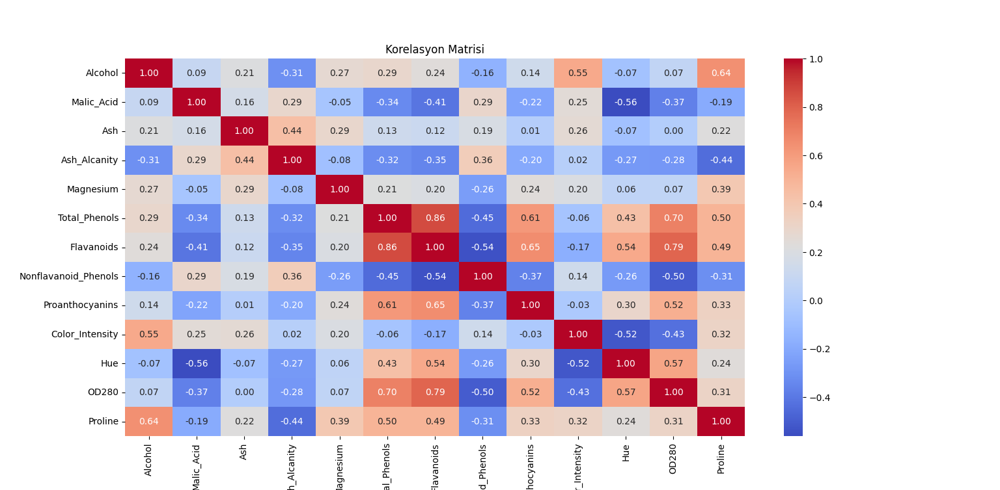
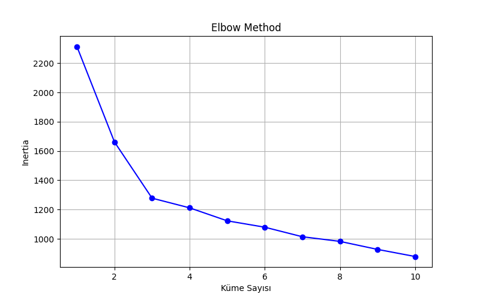
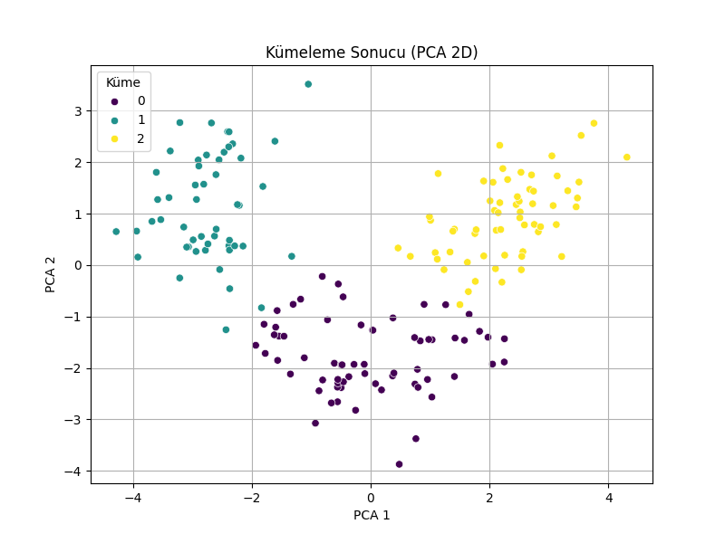

# wine-clustering-exercise
---

## 🍷 Wine Clustering with K-Means and PCA

Bu proje, şarapların kimyasal özelliklerine dayanarak benzerliklerine göre gruplandırılmasını (kümelenmesini) amaçlamaktadır. Proje, veri ön işleme, küme sayısını belirleme ve kümeleme sonuçlarını görselleştirme adımlarını içermektedir.

### 📊 Veri Seti
Çalışmada kullanılan veri seti, Kaggle'dan elde edilen ve farklı şarapların kimyasal analiz sonuçlarını içeren bir veri setidir. Veri seti, Alkol, Malic Acid, Proline gibi toplam 13 farklı özellik (feature) barındırmaktadır.

### 🛠️ Proje Adımları ve Uygulanan Metodlar

#### 1. Veri Keşfi ve Ön İşleme
Projenin ilk aşamasında veri setinin temel yapısı incelenmiştir. `df.info()` ve `df.describe()` gibi metotlarla eksik veri, veri tipleri ve temel istatistikler kontrol edilmiştir. Eksik veri olmadığı tespit edilmiştir.
Ek olarak, özellikler arasındaki ilişkileri anlamak için bir **korelasyon matrisi** oluşturulmuştur. Bu matris, `Proline` ve `Alcohol` gibi bazı özellikler arasında yüksek pozitif korelasyonlar olduğunu göstermektedir. Bu analiz, veri yapısını anlamak için önemli bir ilk adımdır.
### Korelasyon Matrisi

#### 2. Standardizasyon
Veri setindeki özelliklerin farklı ölçeklerde olması, kümeleme algoritmasının performansını etkileyebilir. Bu nedenle, tüm özellikler **`StandardScaler`** kullanılarak standardize edilmiştir. Bu işlem, ortalamayı 0 ve standart sapmayı 1'e getirerek verinin K-Means gibi mesafe tabanlı algoritmalara uygun hale gelmesini sağlar.

#### 3. Optimum Küme Sayısını Belirleme
K-Means algoritması için en uygun küme sayısını belirlemek kritik bir adımdır. Bu projede iki farklı yöntem kullanılmıştır:

* **Elbow Metodu:** Bu metot, farklı küme sayıları için **inertia** (küme içi toplam kareler sapması) değerini görselleştirir. Grafikteki "dirsek" noktasını bularak en uygun küme sayısına karar verilir.
Yukarıdaki grafikte, `k=3`'ten sonra eğimin belirgin bir şekilde azaldığı görülmektedir. Bu da optimum küme sayısının **3** olabileceğini işaret etmektedir.

* **Silhouette Skoru:** Her bir örneğin kendi kümesi içindeki uyumunu ve diğer kümelerden ne kadar ayrıldığını ölçen bir metriktir. 2 ile 10 küme sayısı arasındaki denemelerde en yüksek skor `k=3` ve `k=2` değerleri için elde edilmiştir.
Her iki metodun sonuçları da `k=3` küme sayısının makul bir seçim olduğunu göstermektedir.

### Elbow Metodu

#### 4. K-Means Kümelemesi ve Görselleştirme
Seçilen 3 küme sayısı ile **K-Means** algoritması standardize edilmiş veri üzerinde çalıştırılmıştır. Kümeleme sonuçlarını iki boyutlu bir düzlemde görselleştirmek için **Principal Component Analysis (PCA)** kullanılmıştır. PCA, veri setinin boyutunu en önemli iki bileşene (PCA 1 ve PCA 2) indirgeyerek veriyi daha kolay yorumlanabilir hale getirir.
Görselleştirme, şarapların üç farklı gruba başarıyla ayrıldığını açıkça göstermektedir. Küme 0, 1 ve 2 olarak etiketlenen bu gruplar, kimyasal özelliklerine göre birbirlerinden belirgin şekilde farklılaşmaktadır.

### Principal Component Analysis (PCA)

### 🎯 Sonuçlar
Projenin sonunda, her bir kümenin ortalama özellik değerleri incelenerek her kümenin kendine özgü karakteristiği belirlenmiştir. Bu analiz, kümeleme işleminin yalnızca veri noktalarını gruplamakla kalmayıp, aynı zamanda her bir grubun temel özelliklerini ortaya çıkardığını göstermektedir.

* **Küme 0:** Bu kümedeki şaraplar, özellikle yüksek Alcohol, Proline ve Color_Intensity değerleriyle öne çıkmaktadır. Bu özellikler, bu kümedeki şarapların muhtemelen daha güçlü ve yoğun bir profile sahip olduğunu göstermektedir.

* **Küme 1:** Bu gruptaki şaraplar, yüksek Flavanoids, Total_Phenols ve OD280/OD315_of_diluted_wines değerlerine sahiptir. Bu kimyasallar, genellikle kırmızı şaraplarda bulunan tanen ve renk pigmentleri ile ilişkilidir ve bu şarapların daha zengin ve karmaşık bir yapıya sahip olduğunu işaret eder.

* **Küme 2:** Bu küme, diğer gruplara göre daha düşük Flavanoids ve Total_Phenols değerleri sergilerken, Malic_Acid ve Ash_Alcanity değerlerinin daha yüksek olduğu gözlemlenmiştir. Bu profil, genellikle beyaz şarapların karakteristik özelliklerine daha yakındır.

Bu çalışma, **gözetimsiz öğrenme** (unsupervised learning) tekniklerinin veri setindeki gizli yapıları keşfetmek ve bu yapıları anlamlı gruplara ayırmak için ne kadar güçlü araçlar olduğunu ortaya koymaktadır. Küme ortalamalarını inceleyerek, her bir kümenin ne tür bir şarabı temsil ettiğine dair değerli içgörüler elde edilmiştir.

# ENG
## 🍷 Wine Clustering with K-Means and PCA
This project aims to group (cluster) wines based on their chemical properties. The project includes steps for data preprocessing, determining the number of clusters, and visualizing the clustering results.

### 📊 Dataset
The dataset used in this study is a wine dataset obtained from Kaggle, containing the results of chemical analyses of various wines. The dataset contains a total of 13 different features, such as Alcohol, Malic Acid, and Proline.

### 🛠️ Project Steps and Methods Used
#### 1. Data Exploration and Preprocessing
In the first phase of the project, the basic structure of the dataset was examined. Missing data, data types, and basic statistics were checked using methods like df.info() and df.describe(). No missing data was found.

Additionally, a **correlation matrix** was created to understand the relationships between the features. This matrix shows high positive correlations between some features, such as Proline and Alcohol. This analysis is an important first step in understanding the data structure.
### Correlation Matrix

#### 2. Standardization
The varying scales of the features in the dataset can affect the performance of the clustering algorithm. Therefore, all features were standardized using **'StandardScaler'**. This process brings the mean to 0 and the standard deviation to 1, making the data suitable for distance-based algorithms like K-Means.

#### 3. Determining the Optimal Number of Clusters
Determining the most suitable number of clusters for the K-Means algorithm is a critical step. Two different methods were used in this project:

* **Elbow Method:** This method visualizes the **inertia** (the sum of squared distances within clusters) for different numbers of clusters. The most suitable number of clusters is determined by finding the "elbow" point in the graph.

The graph above shows that the slope decreases significantly after k=3. This indicates that the optimal number of clusters could be **3**.

* **Silhouette Score:**  This is a metric that measures how well each sample fits within its own cluster and how well it is separated from other clusters. In the trials between 2 and 10 clusters, the highest scores were obtained for k=3 and k=2.

The results of both methods suggest that k=3 is a reasonable choice for the number of clusters.

### Elbow Method

#### 4. K-Means Clustering and Visualization
With the chosen number of clusters as 3, the **K-Means** algorithm was run on the standardized data. **Principal Component Analysis (PCA)** was used to visualize the clustering results on a two-dimensional plane. PCA reduces the dimensionality of the dataset to its two most important components (PCA 1 and PCA 2), making the data easier to interpret.

The visualization clearly shows that the wines have been successfully separated into three distinct groups. These groups, labeled as Cluster 0, 1, and 2, are noticeably different from each other based on their chemical properties.

### Principal Component Analysis (PCA)

# 🎯 Results
At the end of the project, the average feature values of each cluster were examined to determine the unique characteristics of each cluster. This analysis shows that the clustering process not only groups data points but also reveals the core characteristics of each group.

* **Cluster 0:** The wines in this cluster stand out with particularly high values of Alcohol, Proline, and Color_Intensity. These properties suggest that the wines in this cluster likely have a stronger and more intense profile.

* **Cluster 1:** Wines in this group have high values of Flavanoids, Total_Phenols, and OD280/OD315_of_diluted_wines. These chemicals are typically associated with tannins and color pigments found in red wines, indicating that these wines have a richer and more complex structure.

* **Cluster 2:** This cluster shows lower values for Flavanoids and Total_Phenols compared to the other groups, while higher values for Malic_Acid and Ash_Alcanity were observed. This profile is generally closer to the characteristics of white wines.

This work demonstrates how powerful **unsupervised learning** techniques are for discovering hidden structures within a dataset and separating these structures into meaningful groups. By examining the cluster averages, valuable insights were gained into what type of wine each cluster represents.
